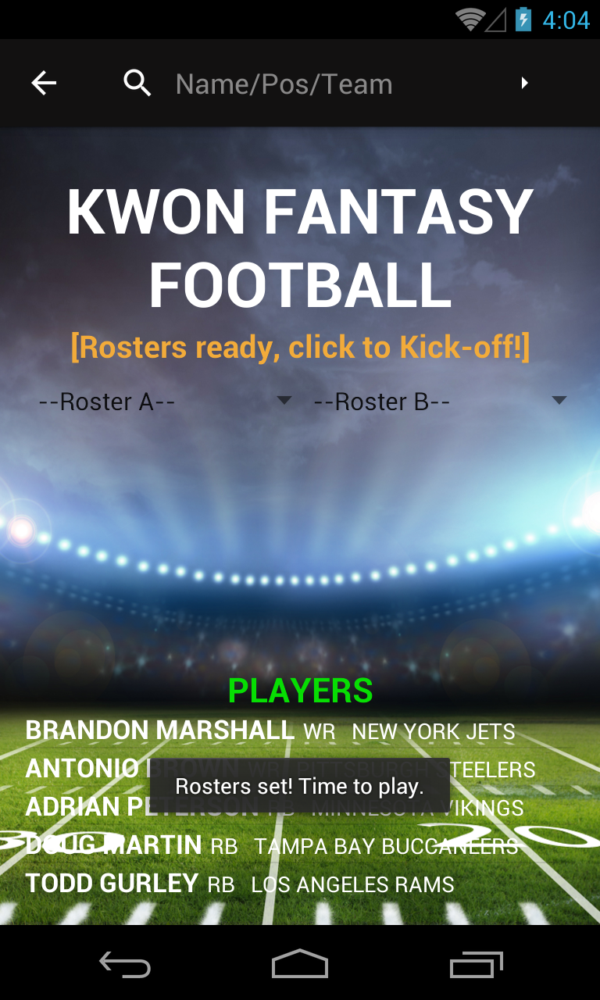
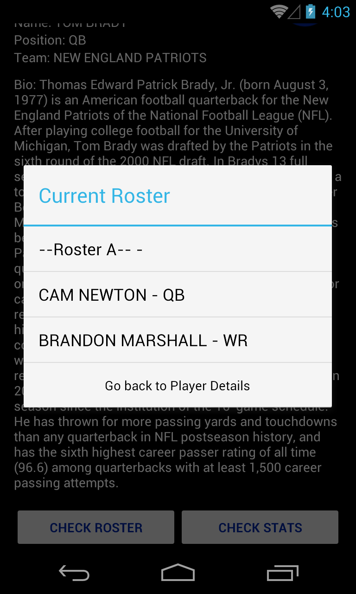
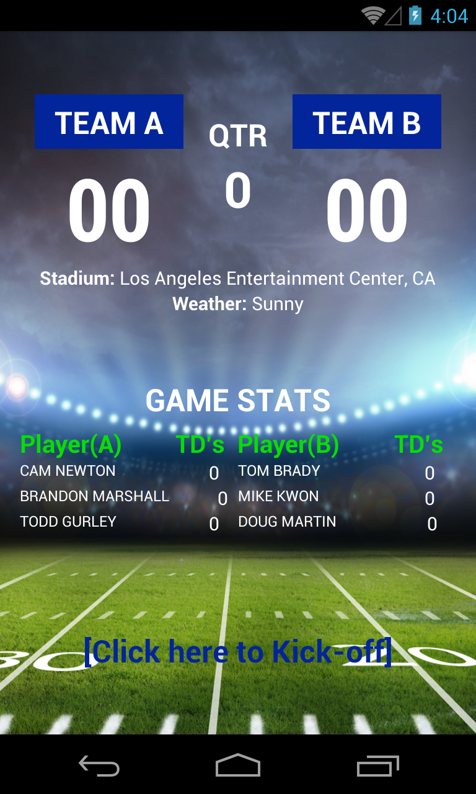
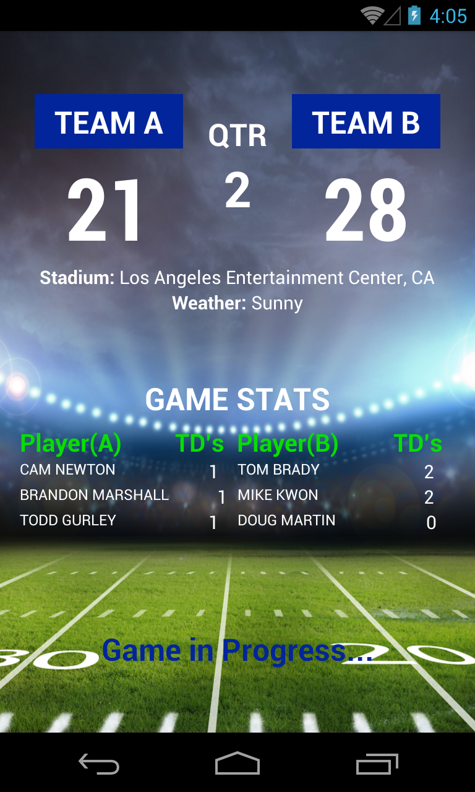

# **Android Development Immersive Project 2**
## **Title: Fantasy Football Simulator**
## **Developer: Mike Kwon**

#### Overview

My second project is a Fantasy Football simulator that allows two users to find and save their favorite football players into their own fantasy rosters, which can then be used to play in a simulated fantasy football game.

---

#### Main Activity

The Main Activity leverages a SQL Database to store player information that can be accessed via a cursor adapter and searchView.  Two Users alternate selecting players and storing their "favorites" into their own fantasy rosters.  Each users' favorite list (Fantasy Roster) is tracked via Singleton ArrayLists, that are displayed via Spinner Elements.  A searchView at the top of the screen facilitates search queries of the database and the search results are displayed in a cursor adapter at the bottom of the page.

Each User will be required to draft a Quarterback, a Wide Receiver, and a Running Back.  Once both Users satisfy their draft requirements, the draft will be closed and they will be prompted to begin the actual simulation.

---

#### Player Detail Activity

Every time a user selects a player in the Main Activity, the Player Detail screen loads with the full details associated with the player from the database.  The Player Detail Activity is given the player's database ID within the intent received, which it uses to pull the correct cursor data.  Within the Detail Screen itself, the user is given options to draft a player, review their fantasy rosters, and execute a Google Search on the player to see additional statistics.

---

#### Game Activity

Once the Fantasy Rosters are set, the Game Activity simulates a football game based off the fantasy rosters established in previous screens.  The Player statistics are generated from the "PlayerStatistics" class, which has an instance included in every "Player" class object.  The statistics are applied against the game engine which includes variables simulating game location (Each player has a home stadium) and weather conditions (sunny,rainy,snowy), which all impact the players' ability to score touchdowns in a game.

---

#### Additional Content

* A class of unit tests are provided to test the key methods leveraged across the application
* An excel document of manual test cases are included, which also provide associated conditionals and user stories