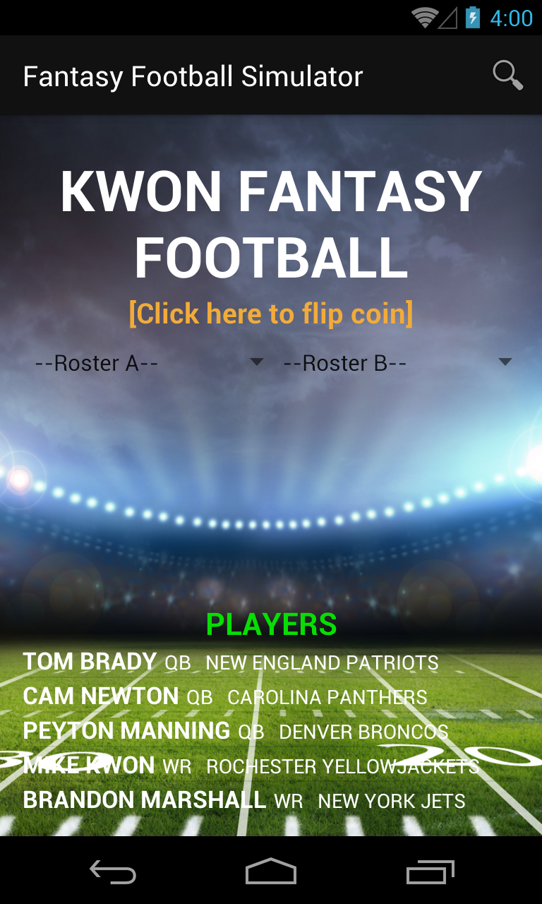
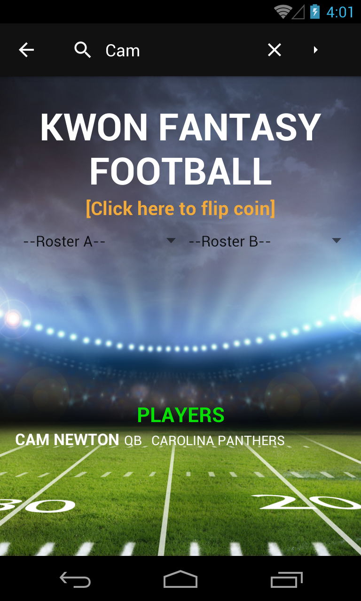

# **Android Development Immersive Project 2**
## **Title: Fantasy Football Simulator**
## **Developer: Mike Kwon**

#### Overview

My second project is a Fantasy Football simulator that allows two users to find and save their favorite football players into their own fantasy rosters, which can then be used to play in a simulated fantasy football game.

---

#### Main Activity

The MainActivity leverages a SQL Database to store player information that can be accessed via a cursor adapter and searchView.  Two Users alternate selecting players and storing their "favorites" into their own fantasy rosters.  Each users' favorite list (Fantasy Roster) is tracked via Singleton ArrayLists, that are displayed via Spinner Elements.  A searchView at the top of the screen facilitates search queries of the database and the search results are displayed in a cursor adapter at the bottom of the page.  User searches can be done against a Player's name, position, and team.  Additionally, the search list will update in real-time as a user types, so users won't have to complete their search if they don't want to.

To complete the draft, each User will be required to draft a Quarterback, a Wide Receiver, and a Running Back.  The 'game engine' will facilitate whose turn it is to draft, and will prevent Users from drafting a player that's already been drafted, or drafting to a that's already accounted for on their roster.  Once both Users satisfy their draft requirements, the draft will be closed and they will be prompted to begin the actual simulation.

---

#### Player Detail Activity

Every time a user selects a player in the MainActivity (from the search list or fantasy roster list), the Player Detail screen loads with the full details associated with the player from the database (name, position, team, bio, image).  The PlayerDetailActivity receives the player's database ID within the intent that launched the activity, and uses the ID to pull the correct cursor data.  Within the Detail Screen itself, the user is given options to draft a player (floating action button), review their fantasy rosters in a dialog screen, and execute a Google Search on the player to see additional statistics.

Pressing the back button will return the User to the MainActivity and allow them to draft someone else.  Additionally, if either User launches a player's detail from their fantasy rosters, the app will not allow them to re-draft the player by accident if they press the floatin action button.

---

#### Game Activity

Once the Fantasy Rosters are set, the Game Activity simulates a football game based off the fantasy rosters established in previous screens.  After clicking the prompt to begin the game, the game engine simulates game scoring that's delayed via a CountDownTimer.  The Player statistics are generated from the "PlayerStatistics" class, which has an instance included in every "Player" class object via composition.  The statistics are applied against the game engine code in the activity.  Additional variables impacting player scores include determining game location (each player has a home stadium) and weather conditions (sunny,rainy,snowy).  Once the game simulation completes, the Users can go back to the MainActivity and will have all rosters & search results reset.

---

#### Additional Content

* A class of unit tests are provided to test the key methods leveraged across the application
* An excel document of manual test cases are included, which also provide associated conditionals and user stories